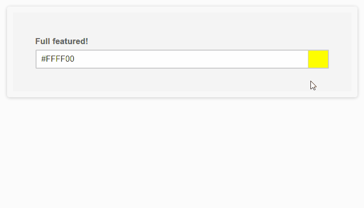

# Pure javascript color picker by LCweb

Long story short: needing a compact solution to insert a standard colorpicker with gradient support in LCweb WordPress plugins, didn't find anything really satisfactory.
So I decided to build my own solution in **pure javascript** aiming to create the most compact and flexible plugin I could for modern web apps.



### Top features list:

- sigle 31KB file, no dependencies, 100% pure javascript
- supports solid color and/on linear gradient and/or radial gradient
- unlimited gradient color steps support
- optional transparency support
- light/dark theme
- adjustable in-field preview
- mobile ready
- multilanguage ready


Tested on all mordern browsers *(don't ask for old IE support please)*
For live demos check: https://lcweb.it/lc-color-picker-javascript-plugin


## Installation & Usage

1. include lc_color_picker.min.js

2. initialize plugin targeting one/multiple text fields


```
<script type="text/javascript>
new lc_color_picker('input');
</script>
```


## Seamless Integration Notes

By default, the plugin will wrap targeted fields with an inline-block DIV. However if you are using percentage sizes on inputs, their sizes could be corrupted.
In this case you have two options:

- enable the *copy_input_width* parameter (NB: static width)

- edit your CSS targeting the the plugin's wrap element, applying sizes also to it. The CSS selector is *.lccp-el-wrap*


## Options

Here are listed available options with default values


```
<script type="text/javascript>
new lc_color_picker('input', {

    // (array) containing supported modes (solid | linear-gradient | radial-gradient) 
    modes : ['solid', 'linear-gradient', 'radial-gradient'], 
    
    // (bool) whether to allow colors transparency tune
    transparency : true, 
    
    // (bool) whether to open the picker when field is focused
    open_on_focus : true, 
    
    // (bool) whether to enable dark picker theme
    dark_theme : false, 
    
    // (bool) whether to stretch the trigger in order to cover the whole input field
    no_input_mode : false, 
    
    // (string) defines the wrapper width. "auto" to leave it up to CSS, "inherit" to statically copy input field width, or any other CSS sizing 
    wrap_width : 'auto',
   
    // (object) defining shape and position of the in-field preview
    preview_style : { 
        input_padding   : 35, // extra px padding eventually added to the target input to not cover text
        side            : 'right', // right or left
        width           : 30,
        separator_color : '#ccc', // (string) CSS color applird to preview element as separator
    },
    
    // (array) defining default colors used when trigger field has no value. First parameter for solid color, second for gradient
    fallback_colors : ['#008080', 'linear-gradient(90deg, #fff 0%, #000 100%)'], 

    // (function) triggered every time field value changes. Passes value and target field object as parameters
    on_change : null, // function(new_value, target_field) {},

    // (array) option used to translate script texts
    labels          : [ 
        'click to change color',
        'Solid',
        'Linear Gradient',
        'Radial Gradient',
        'add gradient step',
        'gradient angle',
        'gradient shape',
        'color',
        'opacity',
    ],
});
</script>
```


* * *


Copyright &copy; Luca Montanari - [LCweb](https://lcweb.it)
